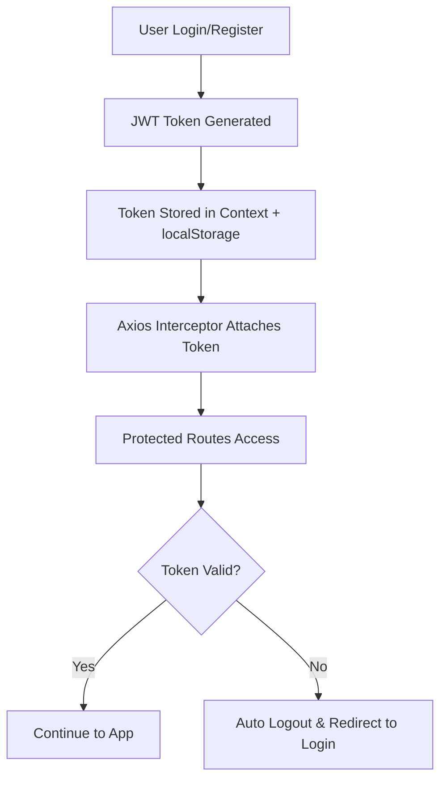

# 🎟️ EventHub

<div align="center">
  
  
  
  
</div>

<div align="center">
  <h3>🚀 A full-stack event management platform for organizers and attendees</h3>
  <p><strong>Create events • Register attendees • Download tickets • Manage seamlessly</strong></p>
</div>

---

## ✨ Features

<table>
<tr>
<td width="50%">

### 👨‍💼 **For Organizers**
- ✅ Create, edit, and delete events
- ⭐ Mark events as **featured**
- 👥 View registered attendees
- 📅 Track **upcoming** vs **ended** events
- 📊 Event management dashboard

</td>
<td width="50%">

### 👥 **For Attendees**
- 🔍 Browse and discover events
- 🎫 Register for events instantly
- 📱 View all registered tickets
- 🖼️ Download beautiful **ticket images**
- 🗑️ Manage ticket registrations

</td>
</tr>
</table>

### ⚙️ **Core Features**
- 🔐 **JWT Authentication** with auto-logout on expiry
- 🎭 **Role-based Access** (Organizer vs Attendee)
- 🌐 **Global Axios Interceptors** for seamless token handling
- 🎨 **Modern TailwindCSS UI** with animations and hover effects
- 🏷️ **Smart Badges** (Featured, Ended status indicators)

---

## 🛠 Tech Stack

<div align="center">

| **Frontend** | **Backend** | **Database** |
|:---:|:---:|:---:|
| React 19 | Express.js | MongoDB |
| Vite 7 | Mongoose | |
| TailwindCSS 4 | JWT Auth | |
| Axios | Bcrypt | |
| React Router DOM | CORS | |

</div>

---

## 📂 Project Structure

```
EventHub/
├── 🎯 backend/
│   ├── models/              # User, Event, Ticket schemas
│   ├── routes/              # Authentication, Events, Tickets API
│   ├── middleware/          # JWT authentication middleware
│   ├── seedEvents.js        # Sample event data population
│   └── server.js            # Express application entry point
│
├── 🎨 frontend/src/
│   ├── pages/               # Home, MyEvents, MyTickets, Profile
│   ├── components/          # EventCard, CreateEventForm, ViewAttendees
│   ├── context/             # UserProvider (global auth state)
│   ├── Auth/                # Login, Register, PrivateRoute components
│   ├── axiosConfig.js       # Axios interceptors configuration
│   └── App.jsx              # Main application component
│
└── 📄 package.json
```

---

## 🚀 Quick Start

### **Prerequisites**
- Node.js (v18+)
- MongoDB (local or cloud)
- Git

### **1. Clone Repository**
```bash
git clone https://github.com/yourusername/eventhub.git
cd eventhub
```

### **2. Backend Setup**
```bash
cd backend
npm install

# Create .env file
echo "MONGO_URI=your_mongodb_connection_string" > .env
echo "JWT_SECRET=your_super_secret_key" >> .env
echo "PORT=4000" >> .env

# Start development server
npm run dev
```

### **3. Frontend Setup**
```bash
cd ../
npm install

# Start development server
npm run dev
```

### **4. Access Application**
🌐 **Frontend**: [http://localhost:5173](http://localhost:5173)  
🔧 **Backend API**: [http://localhost:4000](http://localhost:4000)

---

## 🔐 Authentication Flow



- **Secure JWT Authentication** with automatic token refresh
- **Role-based Authorization** (Organizer vs Attendee permissions)
- **Automatic Logout** on token expiry with seamless redirect

---

## 🎟️ Ticket System

<div align="center">

| **Feature** | **Description** |
|:---|:---|
| 🎫 **Smart Generation** | Auto-created when user registers for events |
| 💾 **Database Storage** | Secure storage with event + user relationships |
| 🖼️ **Visual Downloads** | Beautiful PNG tickets with Canvas rendering |
| ⚡ **Quick Management** | Easy delete/manage from MyTickets dashboard |
| 📱 **QR Integration** | QR code placeholder for future scanning features |

</div>

---

## 📸 Screenshots

<details>
<summary>🖼️ <strong>Click to view screenshots</strong></summary>

### 🏠 **Dashboard View**

*Modern event cards with hover effects and status badges*

### 🎫 **Ticket Download**
  
*Beautiful ticket design with gradient backgrounds and QR codes*

### 📱 **Mobile Responsive**

*Fully responsive design across all devices*

</details>

---

## 🤝 Contributing

We welcome contributions! Here's how to get started:

1. **🍴 Fork** the repository
2. **🌿 Create** your feature branch (`git checkout -b feature/AmazingFeature`)
3. **💾 Commit** your changes (`git commit -m 'Add some AmazingFeature'`)
4. **🚀 Push** to the branch (`git push origin feature/AmazingFeature`)
5. **🔄 Open** a Pull Request

### **Development Guidelines**
- Follow existing code style and conventions
- Add tests for new features
- Update documentation as needed
- Ensure mobile responsiveness

---

## 🐛 Issue Reporting

Found a bug? Have a suggestion? 

1. Check existing [Issues](https://github.com/yourusername/eventhub/issues)
2. Create a new issue with detailed description
3. Use appropriate labels (bug, enhancement, question)

---

## 📋 Roadmap

- [ ] 🔔 **Push Notifications** for event reminders
- [ ] 📊 **Analytics Dashboard** for organizers
- [ ] 💳 **Payment Integration** for paid events
- [ ] 🌍 **Multi-language Support**
- [ ] 📱 **Mobile App** (React Native)
- [ ] 🔍 **Advanced Search & Filtering**

---

## 📜 License

This project is licensed under the **MIT License** - see the [LICENSE](LICENSE) file for details.

---

<div align="center">
  <h3>⭐ Found this helpful? Give it a star!</h3>
  <p>Built with ❤️ by <a href="https://github.com/yourusername">Your Name</a></p>
  
  <p>
    <a href="https://github.com/yourusername/eventhub/stargazers">⭐ Stars</a> •
    <a href="https://github.com/yourusername/eventhub/network/members">🔄 Forks</a> •
    <a href="https://github.com/yourusername/eventhub/issues">🐛 Issues</a>
  </p>
</div>
